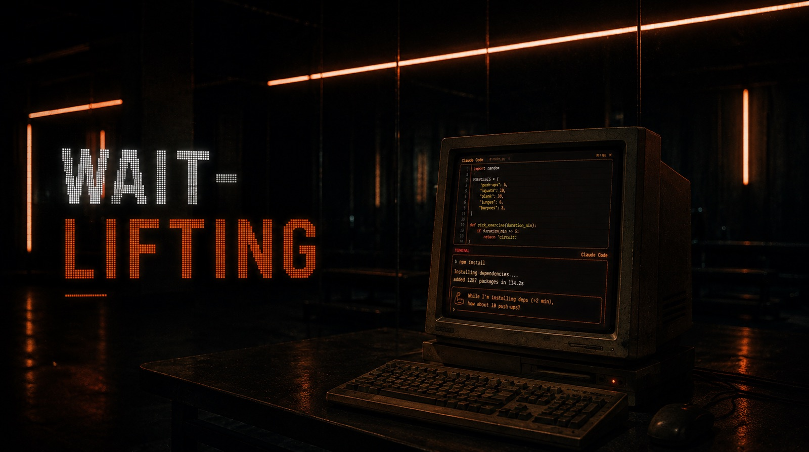

# Wait Lifting 🏋️

[](LICENSE)
[](https://github.com/YanisMtcr/wait-lifting/pulls)
[](https://code.claude.com/docs/en/plugins)

Claude compiles, you do push-ups.

When a long command kicks off (`npm install`, `cargo build`, `pytest`, `docker build`...), your status line turns into a coach:

> 🏋️ While I'm installing deps (~2 min), how about 10 push-ups?

## How it works

- **Hook**: sniffs every Bash command and subagent launch; if it looks like a wait of 1 min or more, drops a workout. Max one per 10 minutes.
- **Skill**: for long work the hook can't see (refactors, research), Claude coaches you itself. Or just ask for a *"vibes check"*.

Reps scale with the wait:

| Wait   | Workout                                         |
|--------|-------------------------------------------------|
| ~1 min | 5 push-ups or 10 squats                         |
| ~3 min | 15 push-ups or 30 squats                        |
| 5 min+ | mini-circuit: 10 push-ups, 20 squats, 30s plank |

## Install

```
/plugin marketplace add YanisMtcr/wait-lifting
/plugin install wait-lifting@wait-lifting
/reload-plugins
/wait-lifting:setup
```

No dependencies, just `python3` on your PATH.

The last command wires the status line (the line under the input box) where the coach shows up. Claude Code doesn't let plugins do that automatically, so it's a one-time step. If you'd rather do it by hand, add this to `~/.claude/settings.json`:

```json
"statusLine": {
  "type": "command",
  "command": "python3 \"$HOME/.claude/plugins/marketplaces/wait-lifting/scripts/statusline.py\""
}
```
